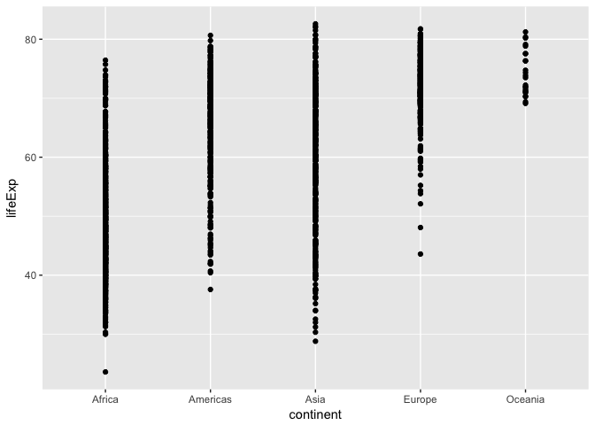
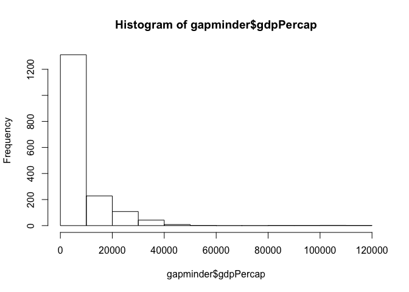
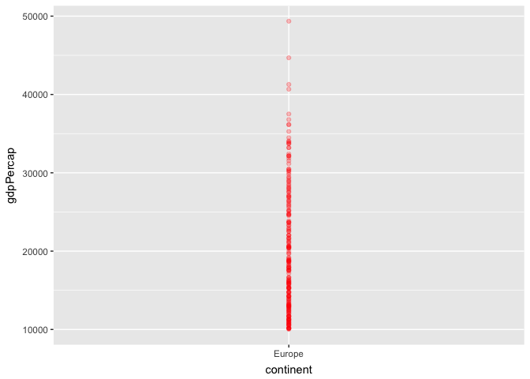

# hw02_gapminder exploration
Maria Guo  
September 21, 2017  

```r
library(tidyverse)
```

```
## Loading tidyverse: ggplot2
## Loading tidyverse: tibble
## Loading tidyverse: tidyr
## Loading tidyverse: readr
## Loading tidyverse: purrr
## Loading tidyverse: dplyr
```

```
## Conflicts with tidy packages ----------------------------------------------
```

```
## filter(): dplyr, stats
## lag():    dplyr, stats
```

```r
library(gapminder)
```

# Explore the gapminder object:

1.Is it a data.frame, a matrix, a vector, a list?


```r
str(gapminder)
```

```
## Classes 'tbl_df', 'tbl' and 'data.frame':	1704 obs. of  6 variables:
##  $ country  : Factor w/ 142 levels "Afghanistan",..: 1 1 1 1 1 1 1 1 1 1 ...
##  $ continent: Factor w/ 5 levels "Africa","Americas",..: 3 3 3 3 3 3 3 3 3 3 ...
##  $ year     : int  1952 1957 1962 1967 1972 1977 1982 1987 1992 1997 ...
##  $ lifeExp  : num  28.8 30.3 32 34 36.1 ...
##  $ pop      : int  8425333 9240934 10267083 11537966 13079460 14880372 12881816 13867957 16317921 22227415 ...
##  $ gdpPercap: num  779 821 853 836 740 ...
```


```r
class(gapminder)
```

```
## [1] "tbl_df"     "tbl"        "data.frame"
```

```r
mode(gapminder)
```

```
## [1] "list"
```

```r
typeof(gapminder)
```

```
## [1] "list"
```
gapminder is a data.frame, can also be a list.


2.What’s its class?


```r
class(gapminder)
```

```
## [1] "tbl_df"     "tbl"        "data.frame"
```
It is data.frame.


3.How many variables/columns?


```r
ncol(gapminder)
```

```
## [1] 6
```
There are 6 variables.


4.How many rows/observations?


```r
nrow(gapminder)
```

```
## [1] 1704
```
there are 1740 rows.


5.Can you get these facts about “extent” or “size” in more than one way? Can you imagine different functions being useful in different contexts?


```r
dim(gapminder)
```

```
## [1] 1704    6
```

```r
length(gapminder)
```

```
## [1] 6
```

6.What data type is each variable?


```r
glimpse(gapminder)
```

```
## Observations: 1,704
## Variables: 6
## $ country   <fctr> Afghanistan, Afghanistan, Afghanistan, Afghanistan,...
## $ continent <fctr> Asia, Asia, Asia, Asia, Asia, Asia, Asia, Asia, Asi...
## $ year      <int> 1952, 1957, 1962, 1967, 1972, 1977, 1982, 1987, 1992...
## $ lifeExp   <dbl> 28.801, 30.332, 31.997, 34.020, 36.088, 38.438, 39.8...
## $ pop       <int> 8425333, 9240934, 10267083, 11537966, 13079460, 1488...
## $ gdpPercap <dbl> 779.4453, 820.8530, 853.1007, 836.1971, 739.9811, 78...
```

country is factor, continent is factor, year and pop are integer, lifeExp and gdpPercap is double.


# Explore individual variables

1. What are possible values (or range, whichever is appropriate) of each variable?

```r
summary(gapminder$continent)
```

```
##   Africa Americas     Asia   Europe  Oceania 
##      624      300      396      360       24
```

```r
summary(gapminder$lifeExp)
```

```
##    Min. 1st Qu.  Median    Mean 3rd Qu.    Max. 
##   23.60   48.20   60.71   59.47   70.85   82.60
```
There are 624 counties in Africa, 300 in America, 396 in Asia, 360 in Europe and 24 countires in Oceania.
lifeExp ranges from 23.6 to 82.60 in dataset.

2. What values are typical? What’s the spread? What’s the distribution? Etc., tailored to the variable at hand.

lifeExp in Asia and Africa are typical amoung other continent. In Africa, lifeExp ranges from 20 to 78, 40 to 80 in Americas, 20 to 82 in Asia, 58 to 81 in Europe and 69 to 81 in Oceania.


```r
ggplot(gapminder,aes(continent, lifeExp)) +
       geom_point()
```

<!-- -->

# Explore various plot types

1. table plot of continent


```r
table(gapminder$continent)
```

```
## 
##   Africa Americas     Asia   Europe  Oceania 
##      624      300      396      360       24
```

```r
barplot(table(gapminder$continent))
```

<!-- -->

2. scatterplot of lifeExp vs log(gdpPercap)


```r
plot(lifeExp ~ log(gdpPercap), gapminder)
```

<!-- -->

3. Histogram 


```r
hist(gapminder$gdpPercap)
```

<!-- -->

# Use filter(), select() and %>%


```r
gapminder %>% 
   filter(continent == "Europe", gdpPercap > 10000) %>% 
   select(lifeExp) 
```

```
## # A tibble: 214 x 1
##    lifeExp
##      <dbl>
##  1  69.540
##  2  70.140
##  3  70.630
##  4  72.170
##  5  73.180
##  6  74.940
##  7  76.040
##  8  77.510
##  9  78.980
## 10  79.829
## # ... with 204 more rows
```


```r
p <- ggplot(gapminder %>% 
           filter(continent == "Europe", gdpPercap > 10000),
           aes(x=continent, y=gdpPercap))
p + geom_point(alpha=0.25, color="red")
```

<!-- -->


# More

1. Evaluate the code

```r
filter(gapminder, country == c("Rwanda", "Afghanistan"))
```

```
## # A tibble: 12 x 6
##        country continent  year lifeExp      pop gdpPercap
##         <fctr>    <fctr> <int>   <dbl>    <int>     <dbl>
##  1 Afghanistan      Asia  1957  30.332  9240934  820.8530
##  2 Afghanistan      Asia  1967  34.020 11537966  836.1971
##  3 Afghanistan      Asia  1977  38.438 14880372  786.1134
##  4 Afghanistan      Asia  1987  40.822 13867957  852.3959
##  5 Afghanistan      Asia  1997  41.763 22227415  635.3414
##  6 Afghanistan      Asia  2007  43.828 31889923  974.5803
##  7      Rwanda    Africa  1952  40.000  2534927  493.3239
##  8      Rwanda    Africa  1962  43.000  3051242  597.4731
##  9      Rwanda    Africa  1972  44.600  3992121  590.5807
## 10      Rwanda    Africa  1982  46.218  5507565  881.5706
## 11      Rwanda    Africa  1992  23.599  7290203  737.0686
## 12      Rwanda    Africa  2002  43.413  7852401  785.6538
```
It is not successful. c() makes a vector of "Rwanda" and "Afghanistan", it doesn't select all date for Rwanda and Afghanistan. Since we want either Rwanda or Afghanistan is true, so use "|" or "%in%" to get all data.


```r
filter(gapminder, country == "Afghanistan")
```

```
## # A tibble: 12 x 6
##        country continent  year lifeExp      pop gdpPercap
##         <fctr>    <fctr> <int>   <dbl>    <int>     <dbl>
##  1 Afghanistan      Asia  1952  28.801  8425333  779.4453
##  2 Afghanistan      Asia  1957  30.332  9240934  820.8530
##  3 Afghanistan      Asia  1962  31.997 10267083  853.1007
##  4 Afghanistan      Asia  1967  34.020 11537966  836.1971
##  5 Afghanistan      Asia  1972  36.088 13079460  739.9811
##  6 Afghanistan      Asia  1977  38.438 14880372  786.1134
##  7 Afghanistan      Asia  1982  39.854 12881816  978.0114
##  8 Afghanistan      Asia  1987  40.822 13867957  852.3959
##  9 Afghanistan      Asia  1992  41.674 16317921  649.3414
## 10 Afghanistan      Asia  1997  41.763 22227415  635.3414
## 11 Afghanistan      Asia  2002  42.129 25268405  726.7341
## 12 Afghanistan      Asia  2007  43.828 31889923  974.5803
```


```r
filter(gapminder, 
       country == "Rwanda" |
           country == "Afghanistan")
```

```
## # A tibble: 24 x 6
##        country continent  year lifeExp      pop gdpPercap
##         <fctr>    <fctr> <int>   <dbl>    <int>     <dbl>
##  1 Afghanistan      Asia  1952  28.801  8425333  779.4453
##  2 Afghanistan      Asia  1957  30.332  9240934  820.8530
##  3 Afghanistan      Asia  1962  31.997 10267083  853.1007
##  4 Afghanistan      Asia  1967  34.020 11537966  836.1971
##  5 Afghanistan      Asia  1972  36.088 13079460  739.9811
##  6 Afghanistan      Asia  1977  38.438 14880372  786.1134
##  7 Afghanistan      Asia  1982  39.854 12881816  978.0114
##  8 Afghanistan      Asia  1987  40.822 13867957  852.3959
##  9 Afghanistan      Asia  1992  41.674 16317921  649.3414
## 10 Afghanistan      Asia  1997  41.763 22227415  635.3414
## # ... with 14 more rows
```


2. Present numerical tables in a more attractive form, such as using knitr::kable().


```r
knitr::kable(head(gapminder), "html")
```

<table>
 <thead>
  <tr>
   <th style="text-align:left;"> country </th>
   <th style="text-align:left;"> continent </th>
   <th style="text-align:right;"> year </th>
   <th style="text-align:right;"> lifeExp </th>
   <th style="text-align:right;"> pop </th>
   <th style="text-align:right;"> gdpPercap </th>
  </tr>
 </thead>
<tbody>
  <tr>
   <td style="text-align:left;"> Afghanistan </td>
   <td style="text-align:left;"> Asia </td>
   <td style="text-align:right;"> 1952 </td>
   <td style="text-align:right;"> 28.801 </td>
   <td style="text-align:right;"> 8425333 </td>
   <td style="text-align:right;"> 779.4453 </td>
  </tr>
  <tr>
   <td style="text-align:left;"> Afghanistan </td>
   <td style="text-align:left;"> Asia </td>
   <td style="text-align:right;"> 1957 </td>
   <td style="text-align:right;"> 30.332 </td>
   <td style="text-align:right;"> 9240934 </td>
   <td style="text-align:right;"> 820.8530 </td>
  </tr>
  <tr>
   <td style="text-align:left;"> Afghanistan </td>
   <td style="text-align:left;"> Asia </td>
   <td style="text-align:right;"> 1962 </td>
   <td style="text-align:right;"> 31.997 </td>
   <td style="text-align:right;"> 10267083 </td>
   <td style="text-align:right;"> 853.1007 </td>
  </tr>
  <tr>
   <td style="text-align:left;"> Afghanistan </td>
   <td style="text-align:left;"> Asia </td>
   <td style="text-align:right;"> 1967 </td>
   <td style="text-align:right;"> 34.020 </td>
   <td style="text-align:right;"> 11537966 </td>
   <td style="text-align:right;"> 836.1971 </td>
  </tr>
  <tr>
   <td style="text-align:left;"> Afghanistan </td>
   <td style="text-align:left;"> Asia </td>
   <td style="text-align:right;"> 1972 </td>
   <td style="text-align:right;"> 36.088 </td>
   <td style="text-align:right;"> 13079460 </td>
   <td style="text-align:right;"> 739.9811 </td>
  </tr>
  <tr>
   <td style="text-align:left;"> Afghanistan </td>
   <td style="text-align:left;"> Asia </td>
   <td style="text-align:right;"> 1977 </td>
   <td style="text-align:right;"> 38.438 </td>
   <td style="text-align:right;"> 14880372 </td>
   <td style="text-align:right;"> 786.1134 </td>
  </tr>
</tbody>
</table>

3. Use more of the dplyr functions for operating on a single table


```r
gapminder %>%
  group_by(continent) %>%
  summarize(n = n(),
            n_countries = n_distinct(country))
```

```
## # A tibble: 5 x 3
##   continent     n n_countries
##      <fctr> <int>       <int>
## 1    Africa   624          52
## 2  Americas   300          25
## 3      Asia   396          33
## 4    Europe   360          30
## 5   Oceania    24           2
```

```r
 gapminder %>% 
    mutate(log = lifeExp*pop) %>%
    arrange(year, desc(pop))
```

```
## # A tibble: 1,704 x 7
##           country continent  year lifeExp       pop  gdpPercap         log
##            <fctr>    <fctr> <int>   <dbl>     <int>      <dbl>       <dbl>
##  1          China      Asia  1952  44.000 556263527   400.4486 24475595188
##  2          India      Asia  1952  37.373 372000000   546.5657 13902756000
##  3  United States  Americas  1952  68.440 157553000 13990.4821 10782927320
##  4          Japan      Asia  1952  63.030  86459025  3216.9563  5449512346
##  5      Indonesia      Asia  1952  37.468  82052000   749.6817  3074324336
##  6        Germany    Europe  1952  67.500  69145952  7144.1144  4667351760
##  7         Brazil  Americas  1952  50.917  56602560  2108.9444  2882032548
##  8 United Kingdom    Europe  1952  69.180  50430000  9979.5085  3488747400
##  9          Italy    Europe  1952  65.940  47666000  4931.4042  3143096040
## 10     Bangladesh      Asia  1952  37.484  46886859   684.2442  1757507023
## # ... with 1,694 more rows
```


4. Adapt exercises from the chapters in the “Explore” section of R for Data Science to the Gapminder dataset.

How many rows and variables in mpg?
there are 234 rows and 11 variables


```r
dim(mpg)
```

```
## [1] 234  11
```
Make a plot of cyl vs hwy in ggplot.


```r
p <-ggplot(data = mpg,
           aes(x = cyl, y = hwy))
p + geom_point()
```

<!-- -->


