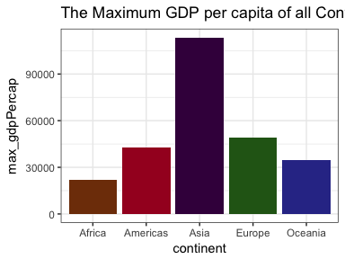
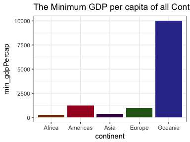
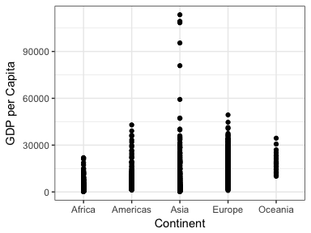
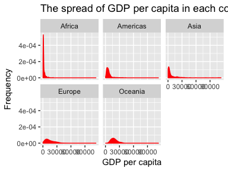
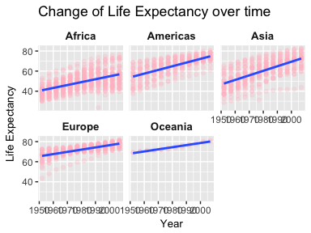
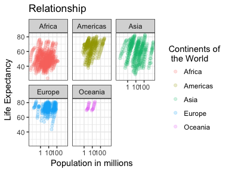
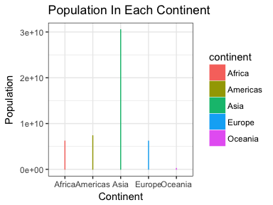

# hw03
Maria Guo  
October 1, 2017  

```r
suppressPackageStartupMessages(library(tidyverse))  # The tidyverse contains ggplot2!
suppressPackageStartupMessages(library(gapminder))
knitr::opts_chunk$set(fig.width=4, fig.height=3)
```

## 1. Get the maximum and minimum of GDP per capita for all continents.

Among all continents, the maximum GDP per capita is 113523.13 from Asia, and the minimum is 241.1659 from Africa.

```r
gapminder %>%
  group_by(continent) %>% 
  summarize(max_gdpPercap=max(gdpPercap), 
            min_gdpPercap=min(gdpPercap))
```

```
## # A tibble: 5 x 3
##   continent max_gdpPercap min_gdpPercap
##      <fctr>         <dbl>         <dbl>
## 1    Africa      21951.21      241.1659
## 2  Americas      42951.65     1201.6372
## 3      Asia     113523.13      331.0000
## 4    Europe      49357.19      973.5332
## 5   Oceania      34435.37    10039.5956
```


```r
gapminder %>%
    group_by(continent) %>% 
    summarize(max_gdpPercap = max(gdpPercap),
              min_dpgPercap = min(gdpPercap)) %>%
    ggplot(aes(continent, max_gdpPercap)) +
    geom_col(fill=continent_colors) +
    theme_bw() +
    labs(title="The Maximum GDP per capita of all Continents")
```

<!-- -->


```r
gapminder %>%
    group_by(continent) %>% 
    summarize(max_gdpPercap = max(gdpPercap),
              min_gdpPercap = min(gdpPercap)) %>%
    ggplot(aes(continent, min_gdpPercap)) +
    geom_bar(aes(continent, min_gdpPercap), stat="identity",  fill=continent_colors) +
    theme_bw() +
    labs(title="The Minimum GDP per capita of all Continents")
```

<!-- -->
For maximum gdp, its quite high in Asia and no much difference among other continents. For minimum gdp, the highest minimum gdp is in Oceania and lowest in Africa and Asia, no much difference in Americas and Europe.


## 2. Look at the spread of GDP per capita within the continents.

In Africa, gdpPercap ranges from 0 to 20000; In Americas, it ranges from 0 to 45000; In Asia, it ranges from 0 to 91500; In Europe, it ranges from 0 to 48000, and in Oceania, it ranges from 10000 to 32000.


```r
ggplot(gapminder, aes(continent, gdpPercap)) +
    geom_point() +
    theme_bw() +
    labs(x="Continent", y="GDP per Capita")
```

<!-- -->


```r
p1 <-gapminder %>% 
  group_by(continent) %>%
  summarize(min_gdp = min(gdpPercap),
         max_gdp = max(gdpPercap),
         mean_gdp = mean(gdpPercap), 
         variant_gdp = var(gdpPercap), 
         median_gdp = median(gdpPercap))

knitr::kable(p1, align = 'c', format = 'markdown', digits = 2, col.names = c("Continent", "Min GDP per cap", "Max GDP per cap", "Mean", "Variant", "Median"))
```


| Continent | Min GDP per cap | Max GDP per cap |   Mean   |  Variant  |  Median  |
|:---------:|:---------------:|:---------------:|:--------:|:---------:|:--------:|
|  Africa   |     241.17      |    21951.21     | 2193.75  |  7997187  | 1192.14  |
| Americas  |     1201.64     |    42951.65     | 7136.11  | 40918591  | 5465.51  |
|   Asia    |     331.00      |    113523.13    | 7902.15  | 197272506 | 2646.79  |
|  Europe   |     973.53      |    49357.19     | 14469.48 | 87520020  | 12081.75 |
|  Oceania  |    10039.60     |    34435.37     | 18621.61 | 40436669  | 17983.30 |


```r
ggplot(gapminder, aes(gdpPercap)) +
  facet_wrap(~ continent) +
  geom_density(color = "red", fill="red") +
  labs(x="GDP per capita", y="Frequency", title = "The spread of GDP per capita in each continent")
```

<!-- -->
In Africa, GDP per capita mainly focuses on a narrow range, however, in other continent, like Americas, not onlyl presents with specific values, but also spread through a wide range of values.


## 3. How is life expectancy changing over time on different continents?

Overall, life expectancy continue growing from 1950 to 2000 in all continents.


```r
ggplot(gapminder, aes(year, lifeExp)) +
    facet_wrap(~ continent) +
    geom_point(aes(year, lifeExp), color = "pink", alpha=0.25) +
    geom_smooth(se=FALSE, method = "lm", span=0.9) +
    theme(strip.background = element_rect(fill="white"),
          axis.title = element_text(size=10),
          strip.text = element_text(size=10, face="bold")) + 
    labs(x="Year", y="Life Expectancy", 
         title = "Change of Life Expectancy over time")
```

<!-- -->

## 4. My own question

Figure out the associate between lifeExp and population in all continents.


```r
ggplot(gapminder, aes(pop/10^6, lifeExp)) +
    geom_point(aes(colour=continent),
               alpha=0.2) +
    facet_wrap(~ continent) +
    scale_colour_discrete("Continents of\n the World") +
    scale_x_log10("Population in millions",
                  breaks=c( 1, 10, 100)) +
    theme_bw() +
    labs(y="Life Expectancy", title ="Relationship")
```

<!-- -->

It is clearly that in all continents, life expectancy is positively correlated with population


## 5. But I want to do more


continent    mean_lifeExp
----------  -------------
Africa           48.86533
Americas         64.65874
Asia             60.06490
Europe           71.90369
Oceania          74.32621

<!-- -->


## 6. Process

1. This assignment is a bit harder than last one, but I will quite interesting when I was working on this, as I apply and combine the functions learned in class to generate multiple graphs and tables.

2. At begining, it is quite confused me about how well should I do, like how detail should I go into, later, I just found that as long as I understand each function and apply to my tables/graphs, I learn something from the assignment.

3. For the 5 question, I did see table and figure side by side, just don't know why in github, table can not show properly. Maybe because of the code I wrote?
