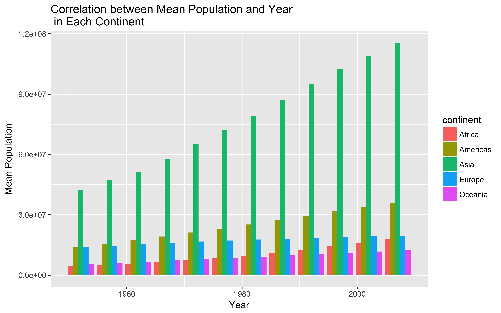

```{r}
library(gapminder)
library(singer)
library(tidyverse)
library(forcats)
library(dplyr)
library(devtools)
library(readr)
library(readxl)
```


# Factor Management
Step goals:

Define factor variables;
Drop factor / levels;
Reorder levels based on knowledge from data.

## Gapminder version
### Drop Oceania
First, let's look at `continent`.
```{r}
class(gapminder$continent)
```
```{r}
levels(gapminder$continent)
```
```{r}
table(gapminder$continent)
table(gapminder$continent)[1:4] %>%
  sum()
```
Ok, there are 5 levels under continent, 24 entries belong to Oceania and 1680 rows correspond to other continents.

Now, lets remove all entries associated with Oceania.
```{r}
drop <- gapminder %>%
  filter(continent != "Oceania")
  
table(drop$continent)
```
Now, Oceania associated observations are removed, however, `Oceania` this level is still present. So now I am gonna use `droplevels` to get rid of unused levels.
```{r}
drop2 <- droplevels(drop)

table(drop2$continent)
```
```{r}
length(drop$continent)
length(drop2$continent)
```
Now, we totally drop the level of Oceania and the number of rows is the same before and after dropping the unused level.

### Reorder the levels of country or continent
I am interested in looking at the maximum and minimum gdp per capita of Asia countries in 2002. First, I will need to filter out the data.


```{r}
gdp_2002 <- gapminder %>%
  filter(continent == "Asia", year == 2002)
nlevels(gdp_2002$country)
```
```{r}
gdp_2002 <- gdp_2002 %>%
  droplevels()
nlevels(gdp_2002$country)
```
Now, let plot it.

```{r}
gdp_2002 %>%
  group_by(country) %>%
  ggplot(aes(gdpPercap,country)) + 
  geom_point(aes((gdpPercap), country)) +
  labs(x="GDP per capita", y="Country", title = "GDP per capita of Asia Countries in 2002")
```
It's hard to get the information we want, so I am going to reorder the levels according to maximum GDP per capita.
```{r}
gdp_2002 %>%
  ggplot(aes(gdpPercap, forcats::fct_reorder(country, gdpPercap))) + 
  geom_point() +
  labs(x="GDP per capita", y="Country", title = "GDP per capita of Asia Countries in 2002")
```
Singapore has highest GDP per capita in 2002 and Myanmar has the minimum GDP per capita.


## File I/O
To create something new, I will use filtered data in Singer.

```{r}
sfile <- singer_locations %>% 
  select(release,duration) %>%
  filter(duration > 800) %>%
  group_by(release) %>% 
  summarise(max_duration=mean(duration))
```

```{r}
write.csv(sfile,"~/Desktop/STAT545-hw-Guo-Maria/hw05/sfile.csv")
read.csv("~/Desktop/STAT545-hw-Guo-Maria/hw05/sfile.csv")
```

```{r}
saveRDS(sfile,"~/Desktop/STAT545-hw-Guo-Maria/hw05/sfile.rds")
readRDS("~/Desktop/STAT545-hw-Guo-Maria/hw05/sfile.rds")
```


```{r}
dput(sfile,"~/Desktop/STAT545-hw-Guo-Maria/hw05/sfile.txt")
dget("~/Desktop/STAT545-hw-Guo-Maria/hw05/sfile.txt")
```

## Visualization design
I am interested in the changes of mean population in each continent overtime. So I first make a plot.
```{r}
mean_pop <- gapminder %>%
  group_by(year,continent) %>%
  mutate(meanpop = mean(pop)) %>%
  ggplot(aes(x=year, y=meanpop)) +
  geom_bar(aes(x=year, y=meanpop, fill=continent),position="dodge", stat="identity") +
  labs(x="Year", y="Mean Population", title="Correlation between Mean Population and Year \n in Each Continent")
mean_pop
```

Now, I will use a new set of colours to improve my plot.
```{r}
library(RColorBrewer)
```

```{r}
mean_pop + scale_fill_manual(values=brewer.pal(n=5, "Dark2"))
```

I also want to try spaghetti plot of life Expectancies over time for each country with Canada highlight in purple.
```{r}
p1 <- scale_colour_manual("", 
                        labels=c("Other Countries", "Canada"),
                        values=c("black", "purple"))
ggplot(gapminder, aes(year, lifeExp)) +
    geom_line(aes(group=country,
                  colour=country=="Canada"), alpha=0.2) +
p1
```
But, it's hard to visualize purple Canada, so I will make all countries besides Canada have transparency, and Canada be non-transparent.

```{r}
ggplot(gapminder, aes(year, lifeExp)) +
    geom_line(aes(group=country,
                  colour=country=="Canada",
                  alpha=country=="Canada")) +
    p1 +
    scale_alpha_discrete(range=c(0.1, 1),
                         guide=FALSE)
```

## Writing figures to file

We have generated some plots in previous section, I will save one in both png and pdf.

```{r}
ggsave("mean_pop.png",
  plot = mean_pop, 
  device = "png",
  width = 8, 
  height = 5,
  dpi = 500)

ggsave("mean_pop.pdf", 
  plot = mean_pop,
  device = "pdf",
  width = 8,
  height = 5)
```




## But I want to do more!
First I am going to make a new data frame.

```{r}
color <- gapminder %>% 
  filter(country %in% c("Germany", "Japan", "Chile", "India", "Canada", "China")) %>% 
  select(country)
knitr::kable(head(color))
```


```{r}
country = c("Germany", "Chile", "India", "Canada", "Japan", "China")
weather = c("rain", "sunny", "rain", "rain", "rain", "sunny")
df= data.frame(country, weather)
```

```{r}
weather2 <- semi_join(df, color, by="country")
```

```{r}
knitr::kable(weather2)
```
Now, we have a new data frame. Let's look at its type.
```{r}
str(weather2)
```

```{r}
weather2 %>%
  mutate(country_condition = fct_lump(weather, n=2)) %>%
  count(country_condition)
```
Now we know that 4 countries are having rain and only 2 countries are sunny.


# Process Report
1. For factor management, it is quite useful to learn and understand how to reorder data.
2. It is easy to save files.
3. It is interesting to know how to change or design color in a plot to have better visual effect.
4. It is also good to learn how to write figure to file.
Overall, as my last assignment, I had a fun time dealing with it.
