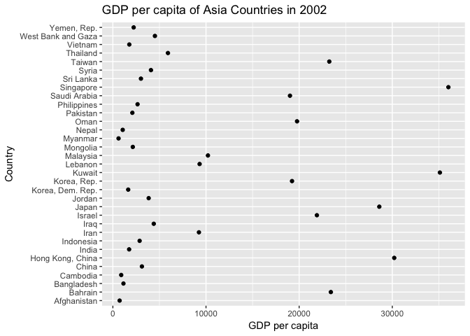
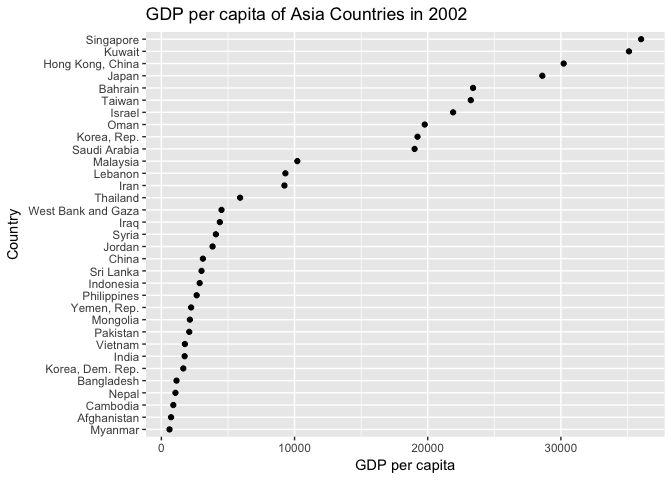
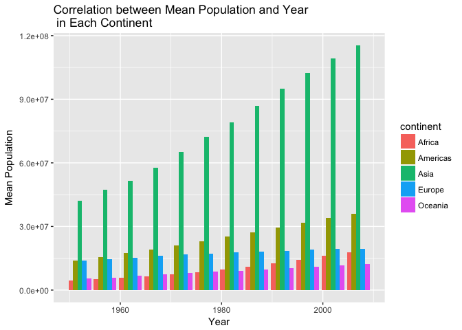
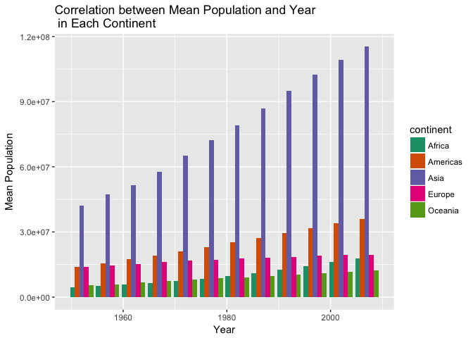
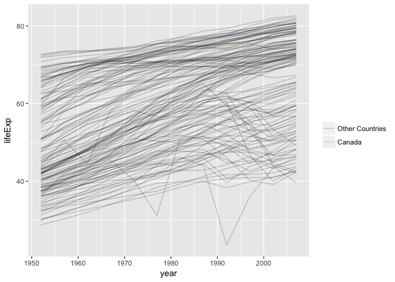
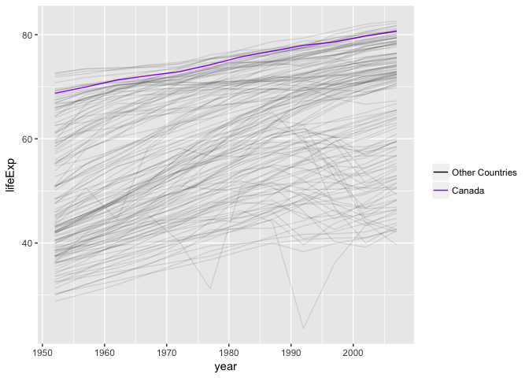

# hw05
Maria Guo  
October 20, 2017  

```r
library(gapminder)
library(singer)
library(tidyverse)
```

```
## Loading tidyverse: ggplot2
## Loading tidyverse: tibble
## Loading tidyverse: tidyr
## Loading tidyverse: readr
## Loading tidyverse: purrr
## Loading tidyverse: dplyr
```

```
## Conflicts with tidy packages ----------------------------------------------
```

```
## filter(): dplyr, stats
## lag():    dplyr, stats
```

```r
library(forcats)
library(dplyr)
library(devtools)
library(readr)
library(readxl)
```


# Factor Management
Step goals:

Define factor variables;
Drop factor / levels;
Reorder levels based on knowledge from data.

## Gapminder version
### Drop Oceania
First, let's look at `continent`.

```r
class(gapminder$continent)
```

```
## [1] "factor"
```

```r
levels(gapminder$continent)
```

```
## [1] "Africa"   "Americas" "Asia"     "Europe"   "Oceania"
```

```r
table(gapminder$continent)
```

```
## 
##   Africa Americas     Asia   Europe  Oceania 
##      624      300      396      360       24
```

```r
table(gapminder$continent)[1:4] %>%
  sum()
```

```
## [1] 1680
```
Ok, there are 5 levels under continent, 24 entries belong to Oceania and 1680 rows correspond to other continents.

Now, lets remove all entries associated with Oceania.

```r
drop <- gapminder %>%
  filter(continent != "Oceania")
  
table(drop$continent)
```

```
## 
##   Africa Americas     Asia   Europe  Oceania 
##      624      300      396      360        0
```
Now, Oceania associated observations are removed, however, `Oceania` this level is still present. So now I am gonna use `droplevels` to get rid of unused levels.

```r
drop2 <- droplevels(drop)

table(drop2$continent)
```

```
## 
##   Africa Americas     Asia   Europe 
##      624      300      396      360
```

```r
length(drop$continent)
```

```
## [1] 1680
```

```r
length(drop2$continent)
```

```
## [1] 1680
```
Now, we totally drop the level of Oceania and the number of rows is the same before and after dropping the unused level.

### Reorder the levels of country or continent
I am interested in looking at the maximum and minimum gdp per capita of Asia countries in 2002. First, I will need to filter out the data.


```r
gdp_2002 <- gapminder %>%
  filter(continent == "Asia", year == 2002)
nlevels(gdp_2002$country)
```

```
## [1] 142
```

```r
gdp_2002 <- gdp_2002 %>%
  droplevels()
nlevels(gdp_2002$country)
```

```
## [1] 33
```
Now, let plot it.


```r
gdp_2002 %>%
  group_by(country) %>%
  ggplot(aes(gdpPercap,country)) + 
  geom_point(aes((gdpPercap), country)) +
  labs(x="GDP per capita", y="Country", title = "GDP per capita of Asia Countries in 2002")
```

<!-- -->
It's hard to get the information we want, so I am going to reorder the levels according to maximum GDP per capita.

```r
gdp_2002 %>%
  ggplot(aes(gdpPercap, forcats::fct_reorder(country, gdpPercap))) + 
  geom_point() +
  labs(x="GDP per capita", y="Country", title = "GDP per capita of Asia Countries in 2002")
```

<!-- -->
Singapore has highest GDP per capita in 2002 and Myanmar has the minimum GDP per capita.


## File I/O
To create something new, I will use filtered data in Singer.


```r
sfile <- singer_locations %>% 
  select(release,duration) %>%
  filter(duration > 800) %>%
  group_by(release) %>% 
  summarise(max_duration=mean(duration))
```


```r
write.csv(sfile,"~/Desktop/STAT545-hw-Guo-Maria/hw05/sfile.csv")
read.csv("~/Desktop/STAT545-hw-Guo-Maria/hw05/sfile.csv")
```

```
##     X                                                release max_duration
## 1   1                                           Act Your Age    1535.9473
## 2   2                                     Banned In New York     849.4755
## 3   3                                           Bitter River    1500.2379
## 4   4                                            Black Gipsy    1539.3171
## 5   5                                      Catch ThirtyThree     802.6902
## 6   6                            Chuck Mangione: Finest Hour     848.2738
## 7   7                                             Club Zebra     882.4420
## 8   8                                     Diadem Of 12 Stars     838.4257
## 9   9                El Prodigioso - Los 50 Años Del Maestro     889.2861
## 10 10                                           Empire Prism    1770.2657
## 11 11                                       Execution Ground     876.4861
## 12 12                                      Get Some Go Again     855.1702
## 13 13                             Glastonbury Fayre Festival    1224.2020
## 14 14                          Here At The End of All Things    1247.8689
## 15 15                              In The Pendulum's Embrace    1069.3481
## 16 16                                   J'ai Pollette D'arnu     867.1604
## 17 17                               Live at the baked Potato     881.2926
## 18 18                Live At The Isle Of Wight Festival 1970    2149.3285
## 19 19                                     Live In Paris 1975    1281.6453
## 20 20                                         Live In Vienna     805.9816
## 21 21                                        Lo-def Pressure    1476.8844
## 22 22                                         Lucid Interval    1276.4208
## 23 23                                                Mogador    1004.0942
## 24 24                          Mona - The Carnivorous Circus     916.4273
## 25 25                                       Murder The Dance    1054.5628
## 26 26                                               On Stage    1262.3408
## 27 27                                               Opus Pia    1626.6967
## 28 28                                     Phat Jam in Milano     806.5563
## 29 29                                          Power Of Lard    1915.7938
## 30 30                                    Pudding En Gisteren    1258.0306
## 31 31                                               Sea Last    1128.0191
## 32 32                                         Shortwavemusic     853.1065
## 33 33                                       Systematic Chaos     998.4257
## 34 34                                   Talk Is Cheap Vol. 3    1418.8926
## 35 35                                 The Black-Man's Burdon     804.2053
## 36 36                 The Complete 1957 Riverside Recordings     813.5571
## 37 37 The Four Feathers (Original Motion Picture Soundtrack)     829.2044
## 38 38                                      The Starry Wisdom     939.8853
## 39 39                                              Wake/Lift     895.8951
```


```r
saveRDS(sfile,"~/Desktop/STAT545-hw-Guo-Maria/hw05/sfile.rds")
readRDS("~/Desktop/STAT545-hw-Guo-Maria/hw05/sfile.rds")
```

```
## # A tibble: 39 x 2
##                                    release max_duration
##                                      <chr>        <dbl>
##  1                            Act Your Age    1535.9473
##  2                      Banned In New York     849.4755
##  3                            Bitter River    1500.2379
##  4                             Black Gipsy    1539.3171
##  5                       Catch ThirtyThree     802.6902
##  6             Chuck Mangione: Finest Hour     848.2738
##  7                              Club Zebra     882.4420
##  8                      Diadem Of 12 Stars     838.4257
##  9 El Prodigioso - Los 50 Años Del Maestro     889.2861
## 10                            Empire Prism    1770.2657
## # ... with 29 more rows
```


```r
dput(sfile,"~/Desktop/STAT545-hw-Guo-Maria/hw05/sfile.txt")
dget("~/Desktop/STAT545-hw-Guo-Maria/hw05/sfile.txt")
```

```
## # A tibble: 39 x 2
##                                    release max_duration
##                                      <chr>        <dbl>
##  1                            Act Your Age    1535.9473
##  2                      Banned In New York     849.4755
##  3                            Bitter River    1500.2379
##  4                             Black Gipsy    1539.3171
##  5                       Catch ThirtyThree     802.6902
##  6             Chuck Mangione: Finest Hour     848.2738
##  7                              Club Zebra     882.4420
##  8                      Diadem Of 12 Stars     838.4257
##  9 El Prodigioso - Los 50 Años Del Maestro     889.2861
## 10                            Empire Prism    1770.2657
## # ... with 29 more rows
```

## Visualization design
I am interested in the changes of mean population in each continent overtime. So I first make a plot.

```r
mean_pop <- gapminder %>%
  group_by(year,continent) %>%
  mutate(meanpop = mean(pop)) %>%
  ggplot(aes(x=year, y=meanpop)) +
  geom_bar(aes(x=year, y=meanpop, fill=continent),position="dodge", stat="identity") +
  labs(x="Year", y="Mean Population", title="Correlation between Mean Population and Year \n in Each Continent")
mean_pop
```

<!-- -->

Now, I will use a new set of colours to improve my plot.

```r
library(RColorBrewer)
```


```r
mean_pop + scale_fill_manual(values=brewer.pal(n=5, "Dark2"))
```

<!-- -->

I also want to try spaghetti plot of life Expectancies over time for each country with Canada highlight in purple.

```r
p1 <- scale_colour_manual("", 
                        labels=c("Other Countries", "Canada"),
                        values=c("black", "purple"))
ggplot(gapminder, aes(year, lifeExp)) +
    geom_line(aes(group=country,
                  colour=country=="Canada"), alpha=0.2) +
p1
```

<!-- -->
But, it's hard to visualize purple Canada, so I will make all countries besides Canada have transparency, and Canada be non-transparent.


```r
ggplot(gapminder, aes(year, lifeExp)) +
    geom_line(aes(group=country,
                  colour=country=="Canada",
                  alpha=country=="Canada")) +
    p1 +
    scale_alpha_discrete(range=c(0.1, 1),
                         guide=FALSE)
```

<!-- -->

## Writing figures to file

We have generated some plots in previous section, I will save one in both png and pdf.


```r
ggsave("mean_pop.png",
  plot = mean_pop, 
  device = "png",
  width = 8, 
  height = 5,
  dpi = 500)

ggsave("mean_pop.pdf", 
  plot = mean_pop,
  device = "pdf",
  width = 8,
  height = 5)
```


## But I want to do more!
First I am going to make a new data frame.


```r
color <- gapminder %>% 
  filter(country %in% c("Germany", "Japan", "Chile", "India", "Canada", "China")) %>% 
  select(country)
knitr::kable(head(color))
```


|country |
|:-------|
|Canada  |
|Canada  |
|Canada  |
|Canada  |
|Canada  |
|Canada  |


```r
country = c("Germany", "Chile", "India", "Canada", "Japan", "China")
weather = c("rain", "sunny", "rain", "rain", "rain", "sunny")
df= data.frame(country, weather)
```


```r
weather2 <- semi_join(df, color, by="country")
```

```
## Warning: Column `country` joining factors with different levels, coercing
## to character vector
```


```r
knitr::kable(weather2)
```


country   weather 
--------  --------
Germany   rain    
Chile     sunny   
India     rain    
Canada    rain    
Japan     rain    
China     sunny   
Now, we have a new data frame. Let's look at its type.

```r
str(weather2)
```

```
## 'data.frame':	6 obs. of  2 variables:
##  $ country: Factor w/ 6 levels "Canada","Chile",..: 4 2 5 1 6 3
##  $ weather: Factor w/ 2 levels "rain","sunny": 1 2 1 1 1 2
```


```r
weather2 %>%
  mutate(country_condition = fct_lump(weather, n=2)) %>%
  count(country_condition)
```

```
## # A tibble: 2 x 2
##   country_condition     n
##              <fctr> <int>
## 1              rain     4
## 2             sunny     2
```
Now we know that 4 countries are having rain and only 2 countries are sunny.


# Process Report
1. For factor management, it is quite useful to learn and understand how to reorder data.
2. It is easy to save files.
3. It is interesting to know how to change or design color in a plot to have better visual effect.
4. It is also good to learn how to write figure to file.
Overall, as my last assignment, I had a fun time dealing with it.

