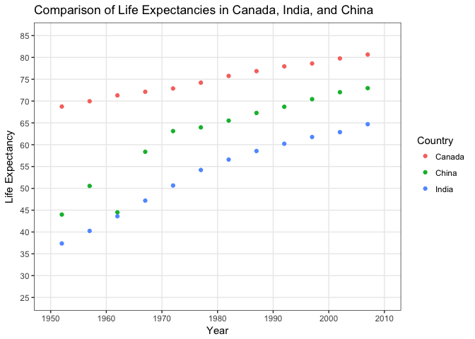

# hw04
Maria Guo  
October 10, 2017  


```r
library(gapminder)
library(tidyverse)
```

```
## Loading tidyverse: ggplot2
## Loading tidyverse: tibble
## Loading tidyverse: tidyr
## Loading tidyverse: readr
## Loading tidyverse: purrr
## Loading tidyverse: dplyr
```

```
## Conflicts with tidy packages ----------------------------------------------
```

```
## filter(): dplyr, stats
## lag():    dplyr, stats
```

```r
library(tidyr)
```

# General data reshaping and relationship to aggregation

## Make a tibble with one row per year and columns for life expectancy for two or more countries.

First, I will compare life expectancy between Canada, China and India by using filter and selection.


```r
lifeExp_Country <- gapminder %>%
        filter(country %in% c('Canada', 'India', 'China')) %>%
        select(country, year, lifeExp)

knitr::kable(lifeExp_Country, 
             align = 'c', format = 'markdown',
             col.names = c("Country", "Year", "Life Expectation"))
```


| Country | Year | Life Expectation |
|:-------:|:----:|:----------------:|
| Canada  | 1952 |     68.75000     |
| Canada  | 1957 |     69.96000     |
| Canada  | 1962 |     71.30000     |
| Canada  | 1967 |     72.13000     |
| Canada  | 1972 |     72.88000     |
| Canada  | 1977 |     74.21000     |
| Canada  | 1982 |     75.76000     |
| Canada  | 1987 |     76.86000     |
| Canada  | 1992 |     77.95000     |
| Canada  | 1997 |     78.61000     |
| Canada  | 2002 |     79.77000     |
| Canada  | 2007 |     80.65300     |
|  China  | 1952 |     44.00000     |
|  China  | 1957 |     50.54896     |
|  China  | 1962 |     44.50136     |
|  China  | 1967 |     58.38112     |
|  China  | 1972 |     63.11888     |
|  China  | 1977 |     63.96736     |
|  China  | 1982 |     65.52500     |
|  China  | 1987 |     67.27400     |
|  China  | 1992 |     68.69000     |
|  China  | 1997 |     70.42600     |
|  China  | 2002 |     72.02800     |
|  China  | 2007 |     72.96100     |
|  India  | 1952 |     37.37300     |
|  India  | 1957 |     40.24900     |
|  India  | 1962 |     43.60500     |
|  India  | 1967 |     47.19300     |
|  India  | 1972 |     50.65100     |
|  India  | 1977 |     54.20800     |
|  India  | 1982 |     56.59600     |
|  India  | 1987 |     58.55300     |
|  India  | 1992 |     60.22300     |
|  India  | 1997 |     61.76500     |
|  India  | 2002 |     62.87900     |
|  India  | 2007 |     64.69800     |

Then, to reshape these data, I will use spread(), which can make “wide” data longer.


```r
reshape_data <- lifeExp_Country %>%
        spread(country,lifeExp) 

knitr::kable(reshape_data,col.names = 
        c('Year','Canada', 'China', 'India'),
        align = 'c',
        format = 'markdown',
        caption = "<h4>Life Expectancy in Canada, China and India Followed by Year</h4>")
```


| Year | Canada |  China   | India  |
|:----:|:------:|:--------:|:------:|
| 1952 | 68.750 | 44.00000 | 37.373 |
| 1957 | 69.960 | 50.54896 | 40.249 |
| 1962 | 71.300 | 44.50136 | 43.605 |
| 1967 | 72.130 | 58.38112 | 47.193 |
| 1972 | 72.880 | 63.11888 | 50.651 |
| 1977 | 74.210 | 63.96736 | 54.208 |
| 1982 | 75.760 | 65.52500 | 56.596 |
| 1987 | 76.860 | 67.27400 | 58.553 |
| 1992 | 77.950 | 68.69000 | 60.223 |
| 1997 | 78.610 | 70.42600 | 61.765 |
| 2002 | 79.770 | 72.02800 | 62.879 |
| 2007 | 80.653 | 72.96100 | 64.698 |

To make format better and easier to read. I will make a scatterplot.


```r
lifeExp_Country %>%
  ggplot(aes(x = year, y = lifeExp, colour=country)) + 
  geom_point() +
  scale_colour_discrete("Country") +
  scale_x_continuous(breaks = seq(1950, 2010, 10),
      labels = as.character(seq(1950, 2010, 10)),
      limits = c(1950, 2010),
      minor_breaks = NULL) +
  scale_y_continuous(breaks = seq(0, 85, 5),
      labels = as.character(seq(0, 85, 5)),
      limits = c(5, 85),
      minor_breaks = NULL) +
  theme_bw() + 
  labs(x = "Year", y = "Life Expectancy",
      title = "Comparison of Life Expectancies in Canada, India, and China")
```

<!-- -->


## Compute some measure of life expectancy (mean? median? min? max?) for all possible combinations of continent and year. Reshape that to have one row per year and one variable for each continent. Or the other way around: one row per continent and one variable per year.

First, I will comoute the mean of life expectancy for each continent at each year.


```r
mean_lifeExp <- gapminder %>%
        group_by(continent, year) %>%
        mutate(lifeExp.mean = mean(lifeExp)) %>%
        select(continent, year, lifeExp.mean) %>%
        unique() %>%
        spread(continent,lifeExp.mean)

knitr::kable(mean_lifeExp,col.names = 
        c('Year','Africa', 'Americas','Europe','Oceania', 'Asia'),
        align = 'c',
        format = 'html', 
        caption = "Mean Life Expectancy")
```

<table>
<caption>Mean Life Expectancy</caption>
 <thead>
  <tr>
   <th style="text-align:center;"> Year </th>
   <th style="text-align:center;"> Africa </th>
   <th style="text-align:center;"> Americas </th>
   <th style="text-align:center;"> Europe </th>
   <th style="text-align:center;"> Oceania </th>
   <th style="text-align:center;"> Asia </th>
  </tr>
 </thead>
<tbody>
  <tr>
   <td style="text-align:center;"> 1952 </td>
   <td style="text-align:center;"> 39.13550 </td>
   <td style="text-align:center;"> 53.27984 </td>
   <td style="text-align:center;"> 46.31439 </td>
   <td style="text-align:center;"> 64.40850 </td>
   <td style="text-align:center;"> 69.2550 </td>
  </tr>
  <tr>
   <td style="text-align:center;"> 1957 </td>
   <td style="text-align:center;"> 41.26635 </td>
   <td style="text-align:center;"> 55.96028 </td>
   <td style="text-align:center;"> 49.31854 </td>
   <td style="text-align:center;"> 66.70307 </td>
   <td style="text-align:center;"> 70.2950 </td>
  </tr>
  <tr>
   <td style="text-align:center;"> 1962 </td>
   <td style="text-align:center;"> 43.31944 </td>
   <td style="text-align:center;"> 58.39876 </td>
   <td style="text-align:center;"> 51.56322 </td>
   <td style="text-align:center;"> 68.53923 </td>
   <td style="text-align:center;"> 71.0850 </td>
  </tr>
  <tr>
   <td style="text-align:center;"> 1967 </td>
   <td style="text-align:center;"> 45.33454 </td>
   <td style="text-align:center;"> 60.41092 </td>
   <td style="text-align:center;"> 54.66364 </td>
   <td style="text-align:center;"> 69.73760 </td>
   <td style="text-align:center;"> 71.3100 </td>
  </tr>
  <tr>
   <td style="text-align:center;"> 1972 </td>
   <td style="text-align:center;"> 47.45094 </td>
   <td style="text-align:center;"> 62.39492 </td>
   <td style="text-align:center;"> 57.31927 </td>
   <td style="text-align:center;"> 70.77503 </td>
   <td style="text-align:center;"> 71.9100 </td>
  </tr>
  <tr>
   <td style="text-align:center;"> 1977 </td>
   <td style="text-align:center;"> 49.58042 </td>
   <td style="text-align:center;"> 64.39156 </td>
   <td style="text-align:center;"> 59.61056 </td>
   <td style="text-align:center;"> 71.93777 </td>
   <td style="text-align:center;"> 72.8550 </td>
  </tr>
  <tr>
   <td style="text-align:center;"> 1982 </td>
   <td style="text-align:center;"> 51.59287 </td>
   <td style="text-align:center;"> 66.22884 </td>
   <td style="text-align:center;"> 62.61794 </td>
   <td style="text-align:center;"> 72.80640 </td>
   <td style="text-align:center;"> 74.2900 </td>
  </tr>
  <tr>
   <td style="text-align:center;"> 1987 </td>
   <td style="text-align:center;"> 53.34479 </td>
   <td style="text-align:center;"> 68.09072 </td>
   <td style="text-align:center;"> 64.85118 </td>
   <td style="text-align:center;"> 73.64217 </td>
   <td style="text-align:center;"> 75.3200 </td>
  </tr>
  <tr>
   <td style="text-align:center;"> 1992 </td>
   <td style="text-align:center;"> 53.62958 </td>
   <td style="text-align:center;"> 69.56836 </td>
   <td style="text-align:center;"> 66.53721 </td>
   <td style="text-align:center;"> 74.44010 </td>
   <td style="text-align:center;"> 76.9450 </td>
  </tr>
  <tr>
   <td style="text-align:center;"> 1997 </td>
   <td style="text-align:center;"> 53.59827 </td>
   <td style="text-align:center;"> 71.15048 </td>
   <td style="text-align:center;"> 68.02052 </td>
   <td style="text-align:center;"> 75.50517 </td>
   <td style="text-align:center;"> 78.1900 </td>
  </tr>
  <tr>
   <td style="text-align:center;"> 2002 </td>
   <td style="text-align:center;"> 53.32523 </td>
   <td style="text-align:center;"> 72.42204 </td>
   <td style="text-align:center;"> 69.23388 </td>
   <td style="text-align:center;"> 76.70060 </td>
   <td style="text-align:center;"> 79.7400 </td>
  </tr>
  <tr>
   <td style="text-align:center;"> 2007 </td>
   <td style="text-align:center;"> 54.80604 </td>
   <td style="text-align:center;"> 73.60812 </td>
   <td style="text-align:center;"> 70.72848 </td>
   <td style="text-align:center;"> 77.64860 </td>
   <td style="text-align:center;"> 80.7195 </td>
  </tr>
</tbody>
</table>

To understand the data easier, I would compare mean life expectanc between 2 continents.


```r
mean_lifeExp <- gapminder %>%
        group_by(continent, year) %>%
        mutate(lifeExp.mean = mean(lifeExp)) %>%
        select(continent, year, lifeExp.mean) %>%
        unique() 

mean_lifeExp %>%
        filter(continent %in% c('Europe','Africa')) %>%
        ggplot(aes(x = year, y = lifeExp.mean, colour = continent)) +
        geom_point() +
        scale_x_continuous(breaks = seq(1950, 2010, 10),
        labels = as.character(seq(1950, 2010, 10)),
        limits = c(1950, 2010),
        minor_breaks = NULL) +
        scale_colour_discrete(name = "continent") +
        theme_bw() +
        labs(x = "Year", y = "Mean Life Expectancy",
        title = "Comparison of Mean Life Expectancy by Year\nbetween Americas and Africa")
```

<!-- -->


# Join, merge, look up

## Activity 1

First, I have to make a second data frame. This time, I use mean population in all continents by year. At this time, to shorter the table, I only show the head part.

```r
second_data_frame <- gapminder %>% 
    filter(continent=="Asia") %>% 
    group_by(year,continent) %>% 
    summarize(mean_pop=mean(pop))

knitr::kable(second_data_frame, align = 'c',format = 'markdown',)
```


| year | continent | mean_pop  |
|:----:|:---------:|:---------:|
| 1952 |   Asia    | 42283556  |
| 1957 |   Asia    | 47356988  |
| 1962 |   Asia    | 51404763  |
| 1967 |   Asia    | 57747361  |
| 1972 |   Asia    | 65180977  |
| 1977 |   Asia    | 72257987  |
| 1982 |   Asia    | 79095018  |
| 1987 |   Asia    | 87006690  |
| 1992 |   Asia    | 94948248  |
| 1997 |   Asia    | 102523803 |
| 2002 |   Asia    | 109145521 |
| 2007 |   Asia    | 115513752 |

Then, I will play around with these two data frame by using various joint functions.

### Left Join
This will save all data in first data fram (gapminder), and add new column in second data frame to it. Therefore, at this time, continents, besides Asia, will have a N/A in new column.


```r
left_join(gapminder,second_data_frame, by = c("continent","year"))
```

```
## # A tibble: 1,704 x 7
##        country continent  year lifeExp      pop gdpPercap  mean_pop
##         <fctr>    <fctr> <int>   <dbl>    <int>     <dbl>     <dbl>
##  1 Afghanistan      Asia  1952  28.801  8425333  779.4453  42283556
##  2 Afghanistan      Asia  1957  30.332  9240934  820.8530  47356988
##  3 Afghanistan      Asia  1962  31.997 10267083  853.1007  51404763
##  4 Afghanistan      Asia  1967  34.020 11537966  836.1971  57747361
##  5 Afghanistan      Asia  1972  36.088 13079460  739.9811  65180977
##  6 Afghanistan      Asia  1977  38.438 14880372  786.1134  72257987
##  7 Afghanistan      Asia  1982  39.854 12881816  978.0114  79095018
##  8 Afghanistan      Asia  1987  40.822 13867957  852.3959  87006690
##  9 Afghanistan      Asia  1992  41.674 16317921  649.3414  94948248
## 10 Afghanistan      Asia  1997  41.763 22227415  635.3414 102523803
## # ... with 1,694 more rows
```

```r
## Warning: Column `continent` joining factor and character vector, coercing
## into character vector
```


### Full Join

It retains all data in both data frame.

```r
full_join(gapminder,second_data_frame, by = c("continent","year"))
```

```
## # A tibble: 1,704 x 7
##        country continent  year lifeExp      pop gdpPercap  mean_pop
##         <fctr>    <fctr> <int>   <dbl>    <int>     <dbl>     <dbl>
##  1 Afghanistan      Asia  1952  28.801  8425333  779.4453  42283556
##  2 Afghanistan      Asia  1957  30.332  9240934  820.8530  47356988
##  3 Afghanistan      Asia  1962  31.997 10267083  853.1007  51404763
##  4 Afghanistan      Asia  1967  34.020 11537966  836.1971  57747361
##  5 Afghanistan      Asia  1972  36.088 13079460  739.9811  65180977
##  6 Afghanistan      Asia  1977  38.438 14880372  786.1134  72257987
##  7 Afghanistan      Asia  1982  39.854 12881816  978.0114  79095018
##  8 Afghanistan      Asia  1987  40.822 13867957  852.3959  87006690
##  9 Afghanistan      Asia  1992  41.674 16317921  649.3414  94948248
## 10 Afghanistan      Asia  1997  41.763 22227415  635.3414 102523803
## # ... with 1,694 more rows
```
### Inner Join
It retains the data that only present in both data frame and add new columns to gapminder.

```r
inner_join(gapminder,second_data_frame, by = c("continent","year"))
```

```
## # A tibble: 396 x 7
##        country continent  year lifeExp      pop gdpPercap  mean_pop
##         <fctr>    <fctr> <int>   <dbl>    <int>     <dbl>     <dbl>
##  1 Afghanistan      Asia  1952  28.801  8425333  779.4453  42283556
##  2 Afghanistan      Asia  1957  30.332  9240934  820.8530  47356988
##  3 Afghanistan      Asia  1962  31.997 10267083  853.1007  51404763
##  4 Afghanistan      Asia  1967  34.020 11537966  836.1971  57747361
##  5 Afghanistan      Asia  1972  36.088 13079460  739.9811  65180977
##  6 Afghanistan      Asia  1977  38.438 14880372  786.1134  72257987
##  7 Afghanistan      Asia  1982  39.854 12881816  978.0114  79095018
##  8 Afghanistan      Asia  1987  40.822 13867957  852.3959  87006690
##  9 Afghanistan      Asia  1992  41.674 16317921  649.3414  94948248
## 10 Afghanistan      Asia  1997  41.763 22227415  635.3414 102523803
## # ... with 386 more rows
```


### Semi Join
It is used to filter out the data that does not match with the one in second data frame, but does not add new columns to gapminder.


```r
semi_join(gapminder,second_data_frame, by = c("continent","year"))
```

```
## # A tibble: 396 x 6
##        country continent  year lifeExp      pop gdpPercap
##         <fctr>    <fctr> <int>   <dbl>    <int>     <dbl>
##  1 Afghanistan      Asia  1952  28.801  8425333  779.4453
##  2 Afghanistan      Asia  1957  30.332  9240934  820.8530
##  3 Afghanistan      Asia  1962  31.997 10267083  853.1007
##  4 Afghanistan      Asia  1967  34.020 11537966  836.1971
##  5 Afghanistan      Asia  1972  36.088 13079460  739.9811
##  6 Afghanistan      Asia  1977  38.438 14880372  786.1134
##  7 Afghanistan      Asia  1982  39.854 12881816  978.0114
##  8 Afghanistan      Asia  1987  40.822 13867957  852.3959
##  9 Afghanistan      Asia  1992  41.674 16317921  649.3414
## 10 Afghanistan      Asia  1997  41.763 22227415  635.3414
## # ... with 386 more rows
```

### Anti Join

This is the inverse type of semi join. It only keep the data that is not present in second data frame. Therefore, all Asia data are removed.

```r
anti_join(gapminder,second_data_frame, by = c("continent","year"))
```

```
## # A tibble: 1,308 x 6
##    country continent  year lifeExp     pop gdpPercap
##     <fctr>    <fctr> <int>   <dbl>   <int>     <dbl>
##  1 Albania    Europe  1952  55.230 1282697  1601.056
##  2 Albania    Europe  1957  59.280 1476505  1942.284
##  3 Albania    Europe  1962  64.820 1728137  2312.889
##  4 Albania    Europe  1967  66.220 1984060  2760.197
##  5 Albania    Europe  1972  67.690 2263554  3313.422
##  6 Albania    Europe  1977  68.930 2509048  3533.004
##  7 Albania    Europe  1982  70.420 2780097  3630.881
##  8 Albania    Europe  1987  72.000 3075321  3738.933
##  9 Albania    Europe  1992  71.581 3326498  2497.438
## 10 Albania    Europe  1997  72.950 3428038  3193.055
## # ... with 1,298 more rows
```


